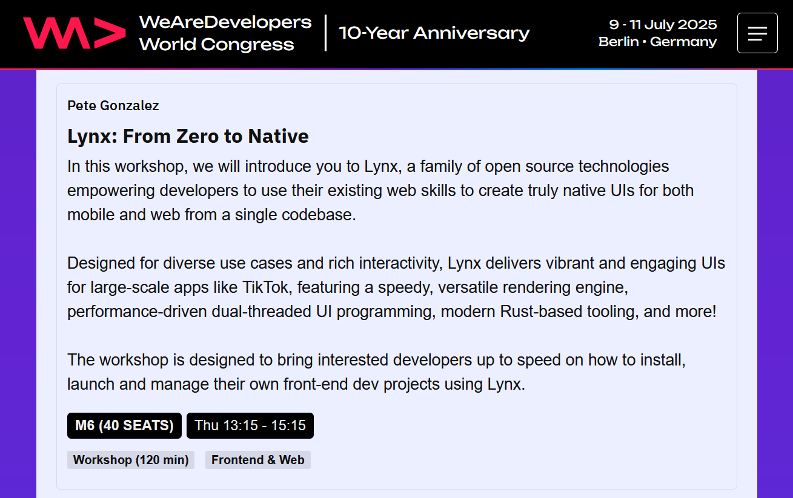
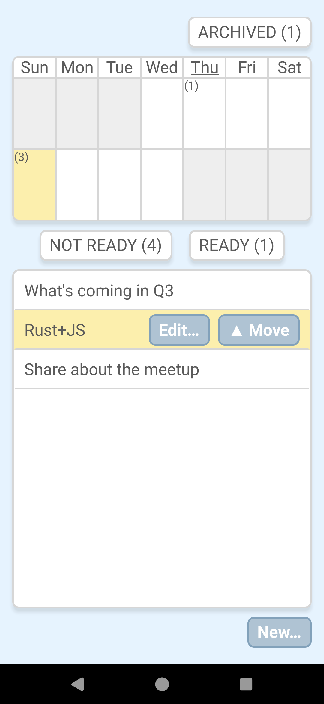
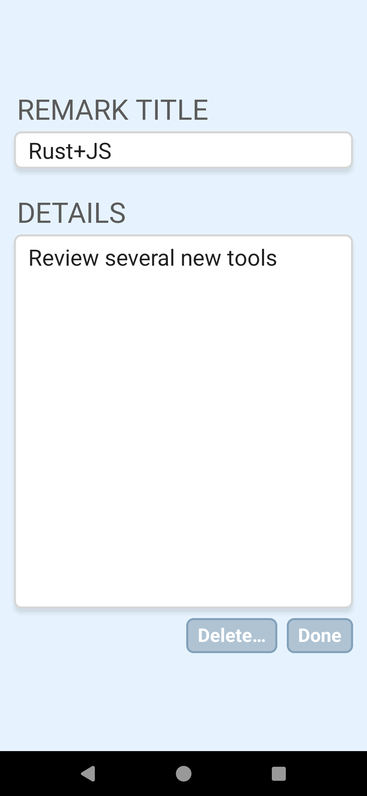

## "remarkable-lynx" tutorial project

[LynxJS](https://lynxjs.org/) is a write-once-run-anywhere framework for developing mobile and web applications using TypeScript.

This tutorial project is part of a [workshop](https://www.wearedevelopers.com/world-congress/workshops) that we hosted at the [WeAreDevelopers World Congress](https://www.wearedevelopers.com/world-congress) in July 2025.

**Lynx: From Zero to Native workshop**



## What does the app do?

This app helps the user plan a regular stream of communications such as internal team announcements or social media posts:  When you think of an idea, you create a "remark" which is initially in the "NOT READY" bucket.  Once you've refined your idea, you move it to the "READY" bucket, which represents a backlog of ready-to-post ideas. Then you can assign them to calendar days over the next week.  (For simplicity, instead of a full calendar, the UX simply tracks the next 7 days.)  After a remark has been posted, you move it to the "ARCHIVED" bucket.

### Lynx concepts

This tutorial introduces the following Lynx features:

- Creating a project from scratch using Rspeedy
- Basic React functional components without reliance on any opinionated frameworks
- A self-contained store that works with `useSyncExternalStore()`
- Usage of `react-router`
- Common elements: `<view>`, `<text>`, `<scroll-view>`, `<textarea>`, `<input>`
- CSS variables
- Some CSS techniques such as `box-shadow`
- Layouts: `grid`, `flex`, `linear`

### Screenshots

<kbd></kbd>

_[MainPage.tsx](./src/pages/MainPage.tsx) screenshot_

<p>&nbsp;</p>

<kbd></kbd>

_[EditPage.tsx](./src/pages/EditPage.tsx) screenshot_

## Tutorial steps

The tutorial steps are tracked as commits to the `main` branch of this repo.  Each commit has a Git tag for easy access.

### Switching to a tutorial step

```shell
# Example: check out step #6
git checkout tags/step-6
```

```shell
# If you want to discard your local changes:
# BE CAREFUL
git reset --hard
```

### Git tags

- `step-1`: pnpm create rspeedy@latest
- `step-2`: Update prettier config
- `step-3`: `prettier -w .`
- `step-4`: Add some deps and settings
- `step-5`: pnpm install
- `step-6`: Add `<input>` and `<textarea>` typings from Lynx dev branch
- `step-7`: Initial sketch of Button and MainPage components
- `step-8`: Define CSS variables for colors
- `step-9`: Touching highlights the button
- `step-10`: Add onClick
- `step-11`: Initial sketch of ListBox component
- `step-12`: Add border and shadow
- `step-13`: Introduce a minimalist subscribeCallback() to power useSyncExternalStore()
- `step-14`: Create a basic AppModel containing a list of RemarkModel items, and tracking a selectedItem
- `step-15`: Wire up the model
- `step-16`: Add useSyncExternalStore() subscription
- `step-17`: Implement the "New..." button
- `step-18`: Introduce BucketId and selectedBucketId
- `step-19`: Add Bucket component
- `step-20`: Add "Archived" bucket
- `step-21`: Filter listbox to show selectedBucketId
- `step-22`: Buckets show item count
- `step-23`: Add "Edit" and "Move" context items
- `step-24`: Implement "Move" button
- `step-25`: Add EditPage
- `step-26`: Add global styles for `<input>` and `<textarea>`
- `step-27`: Add a router and navigation
- `step-28`: Implement "Delete" button
- `step-29`: Add Calendar component

## Development APK

The [EditPage.tsx](./src/pages/EditPage.tsx) relies on new `<input>` and `<textarea>` features from Lynx that have not been officially released yet.  As of July 2025, to use them with LynxExplorer, you will need to build it from the development branch.  (Otherwise, the demo will work, but the EditPage will not render correctly.)

If you don't have native build tools, a prebuilt APK for Android is provided [here](https://github.com/octogonz/wearedevelopers-lynxjs/releases/tag/lynx-explorer-apk).  Or you can wait for the next official release of Lynx.  Nightly snapshot builds will be available soon for Lynx as well.
